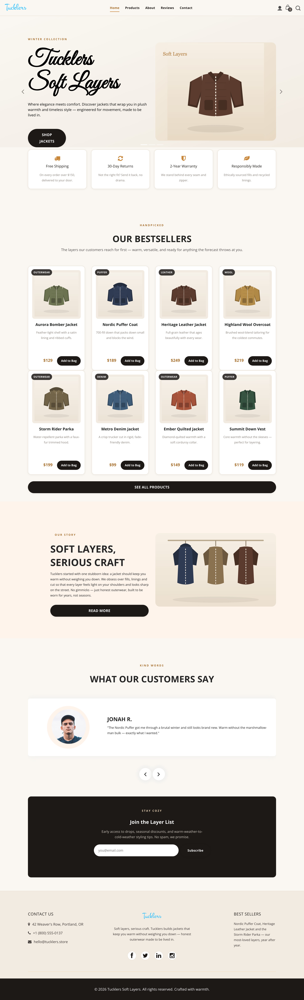
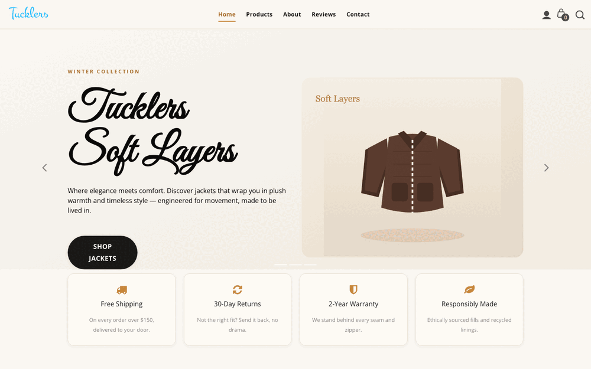
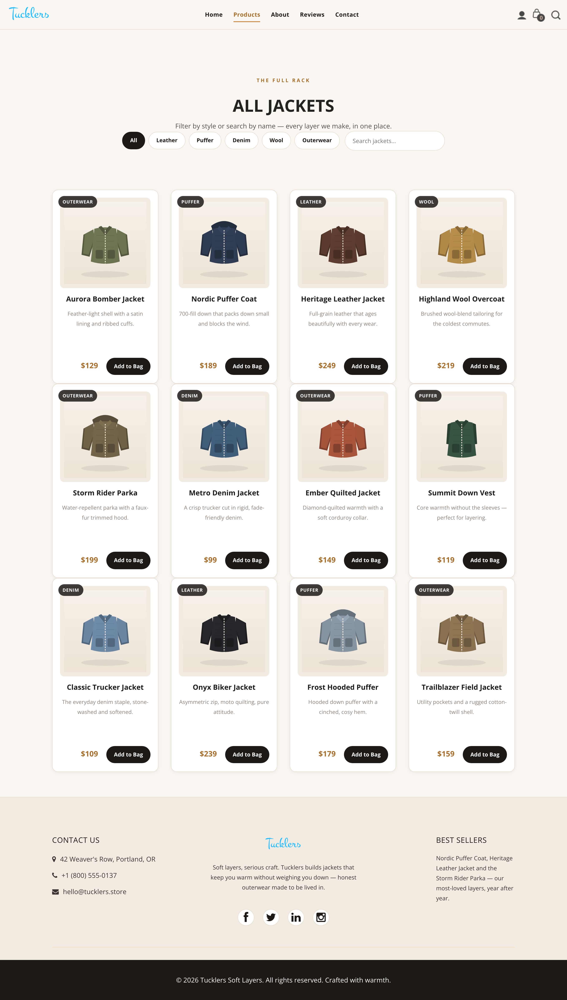
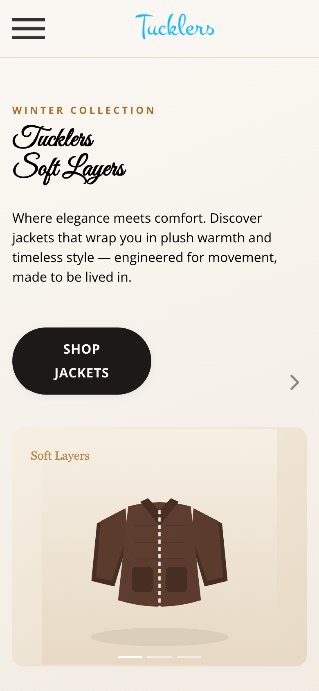
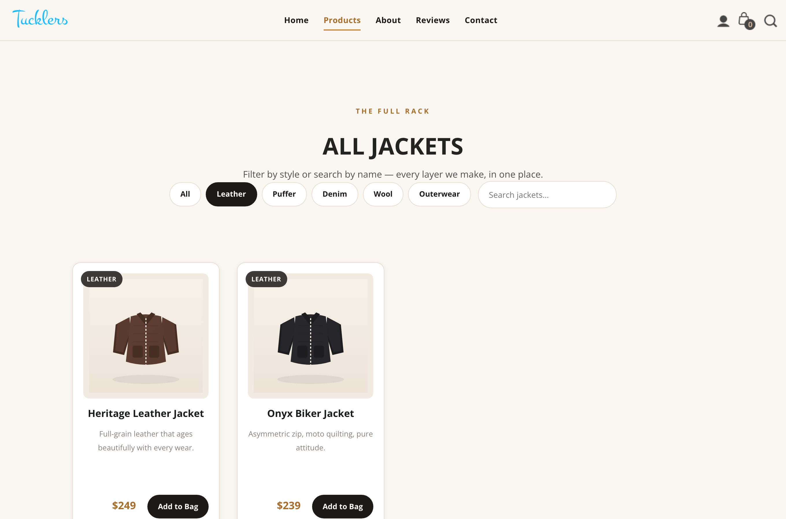

<div align="center">

# Tucklers Soft Layers 🧥

### Jackets that feel like a hug — a fast, hand-built, zero-dependency storefront.

Bombers, puffers, leather and wool. All warmth, no bulk, no build step.

[](https://developer.mozilla.org/docs/Web/HTML)
[](https://developer.mozilla.org/docs/Web/CSS)
[](https://developer.mozilla.org/docs/Web/JavaScript)
[](#-get-it-running-yes-even-if-this-is-your-first-repo)
[](#-built-with)
[](LICENSE)



</div>

---

## 🎬 See it in motion



> **Note:** `assets/demo.gif` is a placeholder. Drop in a real screen recording of the
> filter, the shopping bag counter and the mobile menu to bring this section to life.

---

## ✨ What's inside

- **Five hand-stitched pages** — Home, Products, About, Reviews and Contact, all sharing one consistent header, footer and design language.
- **A real product catalog** — 12 jackets across Leather, Puffer, Denim, Wool and Outerwear, each with its own illustration, price and blurb.
- **Live filter + search** — narrow the rack by category *or* type a name and watch it filter in real time. No page reloads, no waiting.
- **A persistent shopping bag** — tap *Add to Bag* and the counter ticks up, saved to `localStorage` so it survives page hops and refreshes.
- **A validating contact form** — friendly inline errors, a proper email check, and a warm confirmation when everything's in order.
- **Newsletter capture** — the "Layer List" signup validates the address and remembers your subscriber locally.
- **Self-contained artwork** — every jacket is a crisp, hand-authored SVG. No external image hosts, no broken hotlinks, razor-sharp on any screen.
- **Genuinely responsive** — a sticky top nav on desktop that folds into a full-screen slide-out menu on mobile, plus a back-to-top button and toast notifications.

| Products & filters | On your phone |
| --- | --- |
|  |  |

Filter the rack by style — here's everything leather:



---

## 🚀 Get it running (yes, even if this is your first repo)

You genuinely don't need Node, npm, or any toolchain. Pick whichever path feels comfy.

### Prerequisites

- A web browser (you already have one — you're reading this).
- *Optional:* [Python 3](https://www.python.org/downloads/) **or** [Node.js](https://nodejs.org/) if you want a tiny local server (recommended, so relative paths and the fonts behave exactly like production).

### Option A — the two-second way

```bash
# 1. Grab the code
git clone https://github.com/waleedsworld/fashion-tucklers.git
cd fashion-tucklers

# 2. Open it
open index.html        # macOS
# or: xdg-open index.html   (Linux)
# or: start index.html      (Windows)
```

That's it. Double-clicking `index.html` in your file explorer works too.

### Option B — with a local server (recommended)

Serving over `http://` (instead of `file://`) makes everything behave just like the live site.

```bash
git clone https://github.com/waleedsworld/fashion-tucklers.git
cd fashion-tucklers

# Python (ships with macOS / most Linux)
python3 -m http.server 5766

# …or Node, if that's more your speed
npx serve .
```

Then open **http://localhost:5766** in your browser. To stop the server, hit `Ctrl + C`.

---

## 🕹️ Using the site

Everything is driven by plain HTML attributes and a single vanilla-JS file (`js/tucklers.js`) — no config, no API keys.

| Feature | How to use it | Where it lives |
| --- | --- | --- |
| **Browse the catalog** | Open `products.html` — 12 jackets rendered as cards. | `products.html` |
| **Filter by style** | Click a category chip (*Leather, Puffer, Denim, Wool, Outerwear*). | `[data-cat]` attribute |
| **Live search** | Type in the search box; matching jackets fade in as you go. | `[data-name]` attribute |
| **Add to bag** | Hit *Add to Bag* — the header counter increments and a toast confirms. | `data-name` on the button |
| **Persistent bag** | The counter is stored in `localStorage`, so it survives refreshes and page changes. | `tucklers.js` |
| **Contact form** | Fill in `contact.html`; empty fields and bad emails get friendly inline errors. | `contact.html` |
| **Newsletter** | Enter an email in the footer "Layer List" — validated and remembered locally. | footer, every page |
| **Mobile menu** | Shrink the window; the nav collapses into a full-screen slide-out. | responsive nav |

### Adding a new jacket

No JavaScript required. Copy any `.col-lg-3` product card in `products.html`, then set two data attributes:

```html
<div class="col-lg-3" data-cat="leather" data-name="Aviator Bomber">
  <!-- image, title, price, Add-to-Bag button -->
</div>
```

- `data-cat` — one of `leather`, `puffer`, `denim`, `wool`, `outerwear`.
- `data-name` — the display name that search matches against.

It slots straight into the filter **and** the live search automatically.

---

## 🗂️ Architecture

A flat, static site — every page is a standalone HTML document that pulls in the same
shared CSS and one behaviour script. There is no router, no bundler and no server-side
code; the browser is the entire runtime.

```
fashion-tucklers/
├── index.html          # Home — hero, bestsellers, story, reviews, newsletter
├── products.html       # Full catalog with live filter + search
├── about.html          # Brand story + stats
├── client.html         # Customer reviews
├── contact.html        # Contact cards + validating form + map
├── css/
│   ├── bootstrap.min.css   # Grid + base (vendored)
│   ├── style.css           # Original template styles
│   ├── responsive.css      # Breakpoint tweaks
│   └── tucklers.css        # ← our enhancement layer (palette, cards, forms…)
├── js/
│   ├── jquery.min.js           # Needed only for Bootstrap's carousel
│   ├── bootstrap.bundle.min.js
│   └── tucklers.js             # ← all our behaviour, vanilla, zero trackers
├── images/
│   ├── img-1.svg … img-12.svg  # Hand-authored jacket illustrations
│   ├── hero-jacket.svg, about-jackets.svg
│   └── logo.png, *-icon.png    # Brand + UI icons
├── assets/
│   └── demo.gif                # Walkthrough recording (placeholder)
└── docs/media/                 # Screenshots used in this README
```

**How the layers fit together:**

- **Markup** — five hand-written pages sharing an identical header/footer so navigation feels seamless.
- **Styling** — vendored Bootstrap handles the grid and carousel; `tucklers.css` layers the brand palette, cards, buttons and form styling on top via CSS custom properties.
- **Behaviour** — `tucklers.js` is the single source of interactivity: bag counter, filter, live search, form validation, newsletter capture, back-to-top and toasts. It reads `data-*` attributes from the markup, so content and logic stay decoupled.
- **State** — the only persisted state is the shopping-bag count and newsletter subscriber, both in `localStorage`. No cookies, no trackers, no network calls.

---

## 🧪 A/B testing

A tiny, zero-dependency experiment harness lives in `js/ab-testing.js`. It gives
each visitor a **sticky, deterministic variant** (bucketed from a locally-stored
visitor id), buffers exposure and goal events in `localStorage`, and — unless you
point it at an endpoint — never phones home.

Run an experiment straight from markup. The home hero already ships one:

```html
<a href="…"
   data-ab-experiment="hero_cta"
   data-ab-variants="a,b"
   data-ab-text-a="Shop Jackets"
   data-ab-text-b="Shop the Collection"
   data-ab-goal="hero_cta_click">Shop Jackets</a>
```

Supported per-variant overrides: `data-ab-text-<v>`, `data-ab-href-<v>`,
`data-ab-class-<v>`, `data-ab-hide-<v>`. Any element with `data-ab-goal` records a
tracked click.

Prefer scripting? The same power sits on `window.abTest`:

```js
abTest.define("price_layout", [{ id: "a", weight: 3 }, { id: "b", weight: 1 }]);
if (abTest.isVariant("price_layout", "b")) { /* show the new layout */ }
abTest.track("checkout_started", { cart: 2 });

abTest.on(function (e) { console.log(e.event, e.props); }); // live event hook
abTest.getAssignments();  // { hero_cta: "a", … }
abTest.getEvents();       // buffered payloads
abTest.configure({ endpoint: "/collect" }); // opt-in beacon delivery
```

---

## 🎨 Making it yours

Everything visual is tuned from a handful of CSS custom properties at the top of
`css/tucklers.css`:

```css
:root {
  --ink: #1c1917;      /* headings & buttons   */
  --accent: #c8873b;   /* warm copper accent   */
  --paper: #faf7f2;    /* page background      */
}
```

Change `--accent` and the whole site re-skins itself — buttons, tags, hovers, the lot.

---

## ✅ Tests

The site ships with no build step, but the behaviour in `js/tucklers.js` is covered
by an automated suite that runs the real script against a headless DOM
([jsdom](https://github.com/jsdom/jsdom)) using Node's built-in test runner — no
extra framework, no browser needed.

```bash
npm install   # one-time: pulls jsdom (the only dev dependency)
npm test      # runs everything under tests/
```

What's covered:

- **Shopping bag** — the badge counter increments on *Add to Bag*, persists to
  `localStorage`, and is restored on the next visit.
- **Filter + search** — category pills, live name search, the two combined (AND),
  and the empty-state message.
- **Forms** — newsletter email validation and subscriber capture, plus the contact
  form's required-field and email checks.
- **Navigation** — the mobile slide-out toggle and active-link highlighting.
- **Page integrity** — every shipped HTML page parses, has a title, loads the shared
  script, and exposes the ids/data hooks the script depends on.

---

## 🧰 Built with

Plain **HTML5**, **CSS3** (custom properties, flexbox, grid) and **vanilla JavaScript** —
with Bootstrap's grid and carousel doing some of the heavy lifting. No build tools,
no bundlers, no analytics phoning home. Just honest front-end, made to be lived in.

---

## 📄 License

Released under the [MIT License](LICENSE) — free to use, modify and build on.

---

<div align="center">

Made with warmth. Now go layer up. 🧣

</div>
